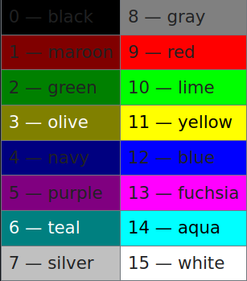
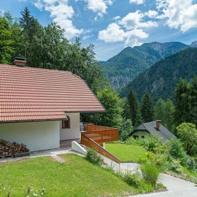
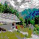
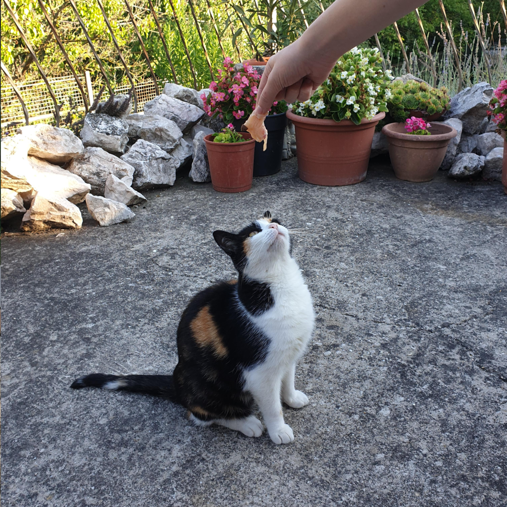
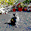

# 1. Ikon készítése képből
#### Kotroczó Ádám - FUN6YZ

## A programról

A program a Windows 3.0 verziójában bevezetett akár 64x64 pixel méretű, 16 színt felhasználó ikonok előállítását hajtja végre. A kiválasztott kép felbontását leviszi és színeit a hozzájuk álló legközelebbi színhez kvantálja. Ez a 16 szín az alábbi előre definiált paletta:



## Használat

A program használatához szükség van OpenCV könyvtárra, ha ez nincs telepítve, akkor futtatás előtt ezt meg kell tenni.

```pip install opencv-python```

Ezután már lehet futtatni a programot.

```python3 iconize.py```

A program először bekéri a az átalakítandó kép elérési útvonalát. Ez az útvonal lehet abszolút vagy relatív is. A következő megadandó paraméter a kimeneti kép felbontása. Alapértelmezett értéke a 64, vagyis a kimeneti kép felbontása 64x64 pixel lesz. Az utolsó paraméter a színek közötti interpoláció módja. Ez lehet két szín között lineáris, vagy euklideszi távolság. <br> Az eredmény az icon_euclidean.png vagy icon_linear.png fájlban lesz található.

### Néhány példa az eredményről:

|  |  |
| --- | --- |

Resolution: 64x64, Interpolation: Euclidean

|  |  |
| --- | --- |

Resolution: 64x64, Interpolation: Linear

|  |  |
| --- | --- |

Resolution: 32x32, Interpolation: Euclidean


##### Milyen jellegű képből lesz jó ikon?

Olyan képekből, melyek kevesebb színből állnak és zajmentesek. Ennek oka, hogy kevésbé komplex képekből a kimenetel is kevésbé lesz komplex, egy ikonnál pedig előnyös az egyszerűség.

##### Hogyan lehetne még ikonszerűbb a kapott kép?

Úgy lehetne ikonszerűbb ha a paletta nem előre meghatározott lenne, hanem a kép alapján lenne kiszámolva.
